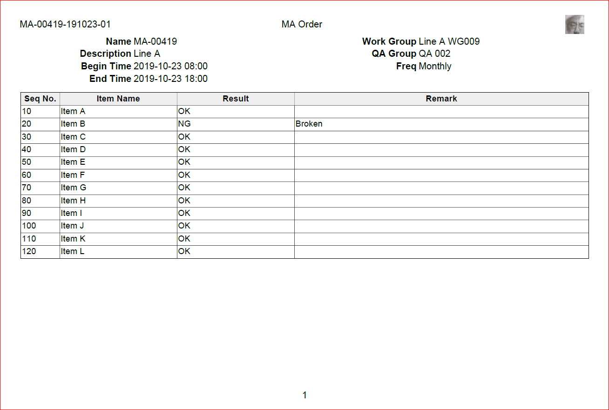

Creation of XSL-FO Template
===

## Movtivation
I need to generate PDF documents based on XML model and __XSLT__ style sheet. The  __Apach FOP__ framework is a good solution, but the __XSL-FO__ the framework uses is hard to be prepared.

Therefore I created this libary to help me quickly create a temporary __XSL-FO__ template which meets __60%__ of the requirements. Then I edited it to meet __100%__ requirements. Finally I used __Apahe FOP__ framework to generate PDF files.


> Due to my poor technology, this library __is not__ a full solution. It just saves the time to __initialize templates__, you need the __XSLT/XSL-FO__ knowledge to edit them to meet all your requirements.

> The libary can export XSL-FO of __Microsot Word__. Maybe you can try to use __Microsot Word__ to design documents and use this libary output XSL-FO result.

## Simple Tutorial

The tutorial will create the document below.




1. Choose content builders.
  * Form
  * Table
  * PageNumber
  * ...  _(depending on the requirements)_


2. Design __XSL-FO__ template and output XML result.

3. Integrated with XSLT.

4. Ouput the PDF file.

### 1. Choose Content Builders

#### Form Builder

1. Thinking of Layout

    |row \ col| 0 |  | _1_ |  |
    |---:|---:|---|---:|---|
    | row: _0_ | __Name__| order/name | __WorkGroup__ | order/workGroup |
    | _1_ | __Description__ | order/description | __QA Group__ | order/qaGroup |
    | _2_ | __Begin Time__ | order/runBeginTime | __MA Type__ | freqName |
    | _3_ | __End Time__ | order/runEndTime|| |

2. The Java Code

    ```java
    FormBuilder from = new FormBuilder(2)
        .addInfo("Name", 0, 0, "order/name")
        .addInfo("Description", 1, 0, "order/description")
        .addInfo("Begin Time", 2, 0, "order/runBeginTime")
        .addInfo("End Time", 3, 0, "order/runEndTime")
        .addInfo("Work Group", 0, 1, "order/workGroup")
        .addInfo("QA Group", 1, 1, "order/qaGroup")
        .addInfo("MA Type", 2, 1, "order/freqName");
    ```

#### Table Builder

1. Thinking of Layout

    | Seq No | Item Name | Result | Remark |
    |---|---|---|---|
    | seqNo | itemName | maResult | maRemark |

2. The Java Code

    ```java
    TableBuilder table = new TableBuilder(4)
        .createHeaders(new String[] { "Seq No", "Item Name", "Result", "Remark" })
        .createRowTemplate(new String[] {
            "seqNo",
            "itemName",
            "maResult",
            "maRemark"
        });
    ```

#### PageNumber Builder

1. Thinking of Layout

    | left | center | right  |
    |---|:---:|---:|
    | | Page Number | |

2. The Java Code

    ```java
    PageNumberBuilder pn = new PageNumberBuilder()
    ```


### 2. Design XSL-FO template

1. The Java Code

    ```java
    // 1. carete a XML builder (fo:root)
    FoXML xml = new FoXML();

    // 2. create a layout (fo:simple-page-master)
    xml.createLayout("MA_ORDER", Paper.A4)
        .enableHeader()
        .enableFooter();

    // 3. create a page (fo:page-sequence)
    FoPage page = xml.addPage("MA_ORDER");

    // 4. 'form' as part of the body of the page (fo:flow)
    form.applyToBody(page);
    // 5. 'table' as part of the body of the page (fo:flow)
    table.applyToBody(page);
    // 6. 'pageNumber' at the footer of the page (fo:static-content)
    pn.applyToFooter(page);

    // 7. generate the XSL-FO content
    String result = xml.build();
    ```

2. Save XSL-FO Content

    ```xml
    <?xml version="1.0" encoding="UTF-8" standalone="yes"?>
    <fo:root xmlns:fo="http://www.w3.org/1999/XSL/Format">
        <fo:layout-master-set>
            <fo:simple-page-master master-name="MA_ORDER_REPORT" page-height="29.7cm" page-width="21.0cm" margin="2cm">
                <fo:region-body region-name="region-body" margin-top="1cm" margin-bottom="1cm"/>
                <fo:region-before region-name="region-header"/>
                <fo:region-after region-name="region-footer"/>
            </fo:simple-page-master>
        </fo:layout-master-set>
        <fo:page-sequence master-reference="MA_ORDER_REPORT" font-family="Arial,sans-serif,SimHei">
            <fo:static-content flow-name="region-header">
                <fo:table margin-bottom="1cm">
                    <fo:table-column column-width="33%"/>
                    <fo:table-column column-width="33%"/>
                    <fo:table-column column-width="33%"/>
                    <fo:table-body>
                        <fo:table-row>
                            <fo:table-cell>
                                <fo:block margin-right="0.1mm"><xsl:value-of select="order/id" /></fo:block>
                            </fo:table-cell>
                            <fo:table-cell>
                                <fo:block margin-right="0.1mm">MA Order</fo:block>
                            </fo:table-cell>
                            <fo:table-cell>
                                <fo:block margin-right="0.1mm"><xsl:value-of select="order/runBeginTime" /></fo:block>
                            </fo:table-cell>
                        </fo:table-row>
                    </fo:table-body>
                </fo:table>
            </fo:static-content>
            <fo:static-content flow-name="region-footer">
                <fo:table margin-bottom="1cm">
                    <fo:table-column column-width="40%"/>
                    <fo:table-column column-width="20%"/>
                    <fo:table-column column-width="40%"/>
                    <fo:table-body>
                        <fo:table-row>
                            <fo:table-cell>
                                <fo:block/>
                            </fo:table-cell>
                            <fo:table-cell>
                                <fo:block text-align="center">
                                    <fo:page-number/>
                                </fo:block>
                            </fo:table-cell>
                            <fo:table-cell>
                                <fo:block text-align="right"/>
                            </fo:table-cell>
                        </fo:table-row>
                    </fo:table-body>
                </fo:table>
            </fo:static-content>
            <fo:flow flow-name="region-body">
                <fo:table margin-bottom="1cm">
                    <fo:table-column column-width="20%"/>
                    <fo:table-column column-width="30%"/>
                    <fo:table-column column-width="20%"/>
                    <fo:table-column column-width="30%"/>
                    <fo:table-body>
                        <fo:table-row>
                            <fo:table-cell>
                                <fo:block font-weight="bold" text-align="right" margin-right="0.1mm">Name</fo:block>
                            </fo:table-cell>
                            <fo:table-cell>
                                <fo:block><xsl:value-of select="order/name" /></fo:block>
                            </fo:table-cell>
                            <fo:table-cell>
                                <fo:block font-weight="bold" text-align="right" margin-right="0.1mm">Work Group</fo:block>
                            </fo:table-cell>
                            <fo:table-cell>
                                <fo:block><xsl:value-of select="order/workGroup" /></fo:block>
                            </fo:table-cell>
                        </fo:table-row>
                        <fo:table-row>
                            <fo:table-cell>
                                <fo:block font-weight="bold" text-align="right" margin-right="0.1mm">Description</fo:block>
                            </fo:table-cell>
                            <fo:table-cell>
                                <fo:block><xsl:value-of select="order/description" /></fo:block>
                            </fo:table-cell>
                            <fo:table-cell>
                                <fo:block font-weight="bold" text-align="right" margin-right="0.1mm">QA Group</fo:block>
                            </fo:table-cell>
                            <fo:table-cell>
                                <fo:block><xsl:value-of select="order/qaGroup" /></fo:block>
                            </fo:table-cell>
                        </fo:table-row>
                        <fo:table-row>
                            <fo:table-cell>
                                <fo:block font-weight="bold" text-align="right" margin-right="0.1mm">Begin Time</fo:block>
                            </fo:table-cell>
                            <fo:table-cell>
                                <fo:block><xsl:value-of select="order/runBeginTime" /></fo:block>
                            </fo:table-cell>
                            <fo:table-cell>
                                <fo:block font-weight="bold" text-align="right" margin-right="0.1mm">Type</fo:block>
                            </fo:table-cell>
                            <fo:table-cell>
                                <fo:block><xsl:value-of select="order/freqName" /></fo:block>
                            </fo:table-cell>
                        </fo:table-row>
                        <fo:table-row>
                            <fo:table-cell>
                                <fo:block font-weight="bold" text-align="right" margin-right="0.1mm">End Time</fo:block>
                            </fo:table-cell>
                            <fo:table-cell>
                                <fo:block><xsl:value-of select="order/runEndTime" /></fo:block>
                            </fo:table-cell>
                            <fo:table-cell/>
                            <fo:table-cell/>
                        </fo:table-row>
                    </fo:table-body>
                </fo:table>
                <fo:table table-layout="auto" border="solid 0.3mm black" margin="0.1mm">
                    <fo:table-column column-width="25%" border="solid 0.1mm black"/>
                    <fo:table-column column-width="25%" border="solid 0.1mm black"/>
                    <fo:table-column column-width="25%" border="solid 0.1mm black"/>
                    <fo:table-column column-width="25%" border="solid 0.1mm black"/>
                    <fo:table-header>
                        <fo:table-row border="solid 0.1mm black" background-color="#eeeeee">
                            <fo:table-cell>
                                <fo:block font-weight="bold" text-align="center">Seq No</fo:block>
                            </fo:table-cell>
                            <fo:table-cell>
                                <fo:block font-weight="bold" text-align="center">Item Name</fo:block>
                            </fo:table-cell>
                            <fo:table-cell>
                                <fo:block font-weight="bold" text-align="center">Result</fo:block>
                            </fo:table-cell>
                            <fo:table-cell>
                                <fo:block font-weight="bold" text-align="center">Remark</fo:block>
                            </fo:table-cell>
                        </fo:table-row>
                    </fo:table-header>
                    <fo:table-body>
                        <fo:table-row border="solid 0.1mm black">
                            <fo:table-cell>
                                <fo:block><xsl:value-of select="seqNo" /></fo:block>
                            </fo:table-cell>
                            <fo:table-cell>
                                <fo:block><xsl:value-of select="itemName" /></fo:block>
                            </fo:table-cell>
                            <fo:table-cell>
                                <fo:block><xsl:value-of select="maResult" /></fo:block>
                            </fo:table-cell>
                            <fo:table-cell>
                                <fo:block><xsl:value-of select="maRemark" /></fo:block>
                            </fo:table-cell>
                        </fo:table-row>
                    </fo:table-body>
                </fo:table>
            </fo:flow>
        </fo:page-sequence>
    </fo:root>
    ```

### 3. Integrated with XSLT
Commonly used tags of XSLT are `xsl:for-each` and `value-of`.

1. Create a new XSLT file and manually add XSL-FO created above.

    ```xml
    <?xml version="1.0" encoding="UTF-8"?>
    <xsl:stylesheet
        version="1.0"
        xmlns:xsl="http://www.w3.org/1999/XSL/Transform"
        xmlns:fo="http://www.w3.org/1999/XSL/Format">
        <xsl:template match="/">
          <!-- XSL-FO template here -->
        </xsl:template>
    </xsl:stylesheet>
    ```

2. Add `xsl:for-each` to bind data for `fo:table-row`.

    ```xml
    <xsl:for-each select="order/items/item">
        <fo:table-row>
          <!-- fo:table-cell -->
        </fo:table-row>
    </xsl:for-each>
    ```

3. Add `value-of` to bind data in right `block`

    ```xml
    <fo:block>
        <xsl:value-of select="order/id" />
    </fo:block>
    ```
4. Modify more to meet the requirements ...

### 4. Output the PDF file
1. Prepare XML data

    ```xml
    <order>
        <id>MA-00419-191023-01</id>
        <name>MA-00419</name>
        <dscription>Line A</dscription>
        <runBeginTime>2019-10-23 08:00</runBeginTime>
        <runEndTime>2019-10-23 18:00</runEndTime>
        <workGroup>Line A WG009</workGroup>
        <qaGroup>QA 002</qaGroup>
        <freqName>Monthly</freqName>
        <items>
            <item>
                <seqNo>10</seqNo>
                <itemName>Item A</itemName>
                <maResult>OK</maResult>
                <maRemark></maRemark>
            </item>
            <item>
                <seqNo>20</seqNo>
                <itemName>Item B</itemName>
                <maResult>NG</maResult>
                <maRemark>Broken</maRemark>
            </item>
            <item>
                <seqNo>30</seqNo>
                <itemName>Item C</itemName>
                <maResult>OK</maResult>
                <maRemark></maRemark>
            </item>
            <item>
                <seqNo>40</seqNo>
                <itemName>Item D</itemName>
                <maResult>OK</maResult>
                <maRemark></maRemark>
            </item>
        </items>
    </order>
    ```

2. The Java Code
    ```java
    PdfFile.newInstance().save(
            new File("output.pdf"),
            new File("data.xml"),
            new File("data.xslt"));
    ```

### Public References

* [XSL-FO Tutorial of W3Schools](https://w3schools.sinsixx.com/xslfo/default.asp.htm) - knowledge based.

* [Apche FOP](https://xmlgraphics.apache.org/fop/) - framework used to output PDF files.

* [XSF-FO XML Schema](https://svn.apache.org/repos/asf/xmlgraphics/fop/trunk/fop/src/foschema/fop.xsd) - XSF-FO schema description.

* [docx4j](https://www.docx4java.org/trac/docx4j) - Microsoft Word handler.

* [docx4j-export-FO](https://github.com/plutext/docx4j-export-FO) - Microsoft Word XSL-FO exporter.
